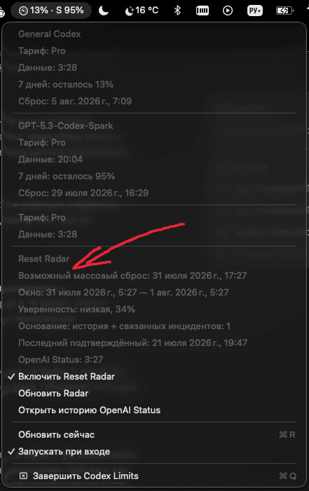
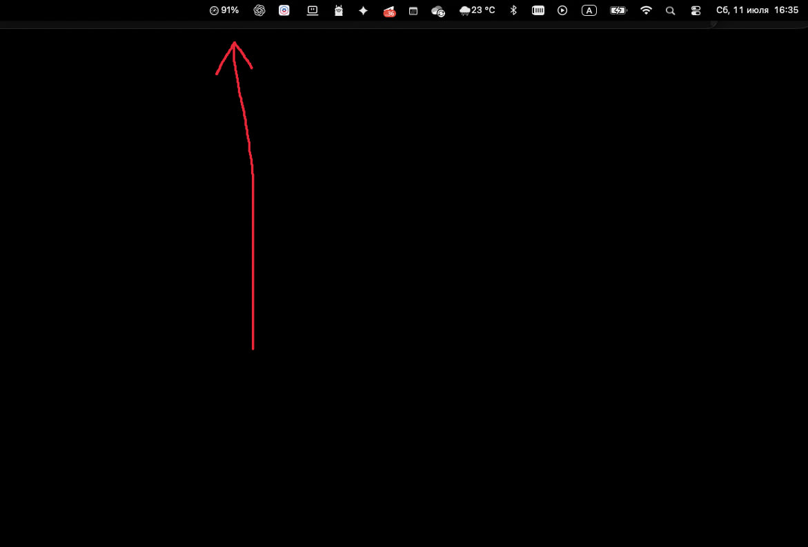
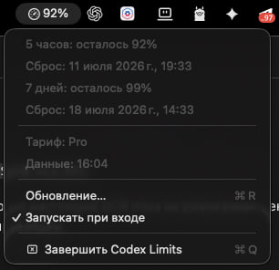

# Codex Limit Bar

A small native macOS menu bar utility that shows the latest Codex usage limits recorded by the local Codex app.


## What's new in 1.1

Codex Limit Bar now keeps the two Codex usage pools separate and adds an experimental forecast for discretionary global limit resets:

- **General Codex / Sol** — the main Codex allowance used by Sol and other standard Codex models remains the primary percentage.
- **Spark** — GPT-5.3-Codex-Spark has its own allowance and appears beside the main value as `S 95%`.
- **Reset Radar** — estimates the next possible global reset window, shows a deliberately conservative confidence level, and explains which public signals affected the forecast.

<p align="center">
  
</p>

In the example above, the menu bar shows `13% · S 95%`: 13% remains in the General Codex / Sol pool, while 95% remains in the separate Spark pool. The menu below those exact local limits shows the predicted global reset window, confidence, evidence count, latest verified reset, and OpenAI Status update time.

## Screenshots

### Compact menu bar indicator

<p align="center">
  
</p>

The status item keeps the current five-hour allowance visible without opening Codex.

### Limit details

<p align="center">
  
</p>

Open the status item to see both usage windows, local reset times, the current plan, refresh status, and launch-at-login control.

## Features

- Displays the General Codex / Sol allowance separately from the dedicated Spark allowance.
- Shows both pools in one compact status item, for example `13% · S 95%`.
- Displays remaining usage for the five-hour and seven-day windows.
- Shows the local reset time for each window.
- Refreshes once per minute with a 10-second timer leeway.
- Refreshes after the Mac wakes from sleep.
- Stores the last known snapshot for offline display.
- Supports launch at login through `SMAppService`.
- Uses a compact native AppKit status item.
- Adds a low-confidence global reset forecast from verified public reset history and relevant OpenAI Status incidents.
- Lets you disable Reset Radar completely while keeping local limit monitoring active.
- Does not read, store, or transmit Codex credentials.

## How it works

Codex writes structured `rate_limits` events to JSONL session files under:

```text
~/.codex/sessions
~/.codex/archived_sessions
```

Codex Limit Bar checks only recently modified JSONL files and reads at most the last 1 MB of each candidate. Limit processing happens locally.

The displayed value is the latest snapshot written by Codex. If Codex has not produced a recent event, the app marks the value as saved rather than live.

Reset Radar requests the public OpenAI Status incidents JSON every 15 minutes. It combines relevant incidents with a small, verified public reset history. The result is an experimental confidence estimate, not an official reset schedule or a guarantee.

Reset Radar can be disabled from the menu. When disabled, its timer stops and the app makes no network requests.

## Requirements

- macOS 13 Ventura or newer
- A local Codex installation that writes session events to `~/.codex`
- Xcode 16 or newer to build from source

## Build from source

1. Clone the repository.
2. Open `CodexLimitBar.xcodeproj` in Xcode.
3. Select your development team under Signing & Capabilities if you want a signed local build.
4. Run the `CodexLimitBar` scheme.

Command-line build without code signing:

```sh
xcodebuild \
  -project CodexLimitBar.xcodeproj \
  -scheme CodexLimitBar \
  -configuration Release \
  -derivedDataPath .build/DerivedData \
  CODE_SIGNING_ALLOWED=NO \
  build
```

Run tests:

```sh
xcodebuild \
  -project CodexLimitBar.xcodeproj \
  -scheme CodexLimitBar \
  -configuration Debug \
  -derivedDataPath .build/DerivedData \
  CODE_SIGNING_ALLOWED=NO \
  test
```

The source package is also mirrored on npm:

```sh
npm pack codex-limit-bar
```

The npm package contains the Xcode source project; it is not a Node.js runtime or a prebuilt macOS application.

## Privacy

The app does not access Codex authentication files or the macOS Keychain and does not send local usage data anywhere. Its only network request is a public, unauthenticated OpenAI Status incidents feed used by Reset Radar. See [SECURITY.md](SECURITY.md) for reporting security issues.

## Limitations

- Codex's local session format is not a guaranteed public API and may change.
- Values update after Codex writes a new rate-limit event.
- Reset Radar cannot see account-specific banked reset credits.
- The global reset forecast is experimental and intentionally capped below 50% confidence without a direct announcement.
- The app intentionally runs without App Sandbox so it can read `~/.codex` automatically.

## Contributing

Contributions are welcome. Read [CONTRIBUTING.md](CONTRIBUTING.md) before opening a pull request.

## License

MIT © 2026 Sergey Kosten. See [LICENSE](LICENSE).
